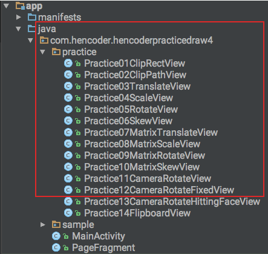
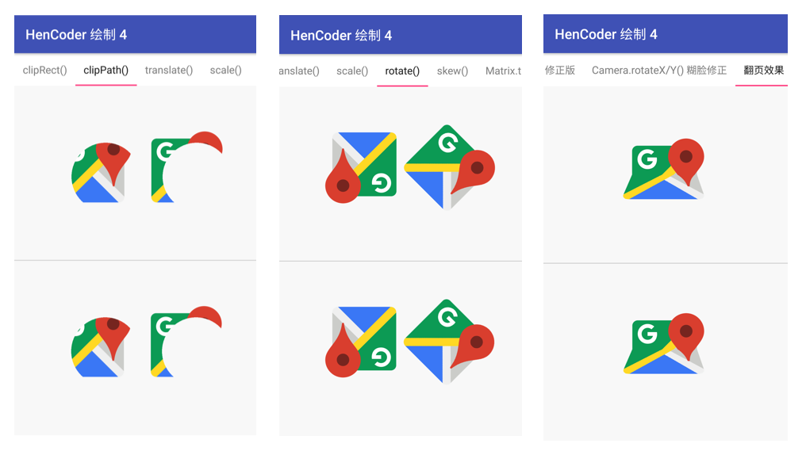
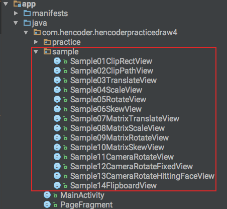

 练习项目
===

### 这是什么？

### 怎么用？

项目是一个可以直接运行的 Android App 项目，项目运行后，在手机上打开是这样的：

工程下有一个 `/practice` 目录：

你要做的是就是，在 `/practice` 下的每一个 `PracticeXxxView.java` 文件中写代码，绘制出和页面上半部分相同的效果。例如写 `Practice01ClipRectView.java` 以绘制出经过平移的图形。就像这样：

如果做不出来，可以参考 `/sample` 目录下的代码：

